# DRL Trading Framework

> **A production-ready Deep Reinforcement Learning framework for algorithmic trading, showcasing modern ML engineering practices and enterprise software architecture.**

[](https://opensource.org/licenses/MIT)
[](https://www.python.org/downloads/)
[](https://github.com/astral-sh/uv)
[](https://gitlab.com/ai1473543/tradingbot3.0)

## Current state

This project is a WIP. The framework is not ready-to-use yet.
Some information may be misleading, some files may be about to be cleaned up, GitLab Pipelines may be breaking and
hexagonal architecture violations may be still around somewhere.

Most mature service so far, which is also the backbone of the system: [drl-trading-preprocess](./drl-trading-preprocess) (~90% code cov and partially e2e tested)

> Side note: This repository is being mirrored from my GitLab Repository

## 🎯 Project Vision

This project is a **learning-driven side project**, born from curiosity about building a well-engineered trading system end-to-end. Some technology choices are intentionally over-engineered for the scale, prioritizing learning and best practices over pragmatism:

**Why Python?**
- Goal: Master Python's ecosystem and ML tooling
- Trade-off: Not suitable for high-frequency trading (HFT) - for that, use C++ or Rust
- Fit: Perfect for algorithmic trading with second-to-minute timeframes

**Why Kafka?**
- Reality: Overkill for this data volume
- Reason: Practice building production-grade event-driven architectures
- Learning: Message brokers, stream processing, and distributed systems patterns

**Why Feast?**
- Reality: Could use simpler feature storage
- Reason: Learn industry-standard ML feature stores and offline/online serving patterns
- Learning: Feature versioning, point-in-time correctness, and low-latency serving

**Why MLflow?**
- Reality: Necessity, not overkill
- Reason: Managing datasets, model versions, hyperparameters, and experiment tracking at scale
- Learning: ML experiment management and model lifecycle

**Why GitLab CI/CD + AWS?**
- Reality: Could use simpler local-only development
- Reason: Practice professional DevOps and MLOps workflows
- Learning: Container orchestration, CI/CD pipelines, and cloud infrastructure

**The Philosophy:** Build it like you'd build it at a top tech company or hedge fund, even if simpler solutions exist. The goal is demonstrating engineering excellence and architectural thinking, not just making it work.

## How It Works

### The 30-Second Overview

1. **Define Your Strategy**: Implement a custom reward function (10-50 lines of code)
2. **Configure Data Sources**: Use built-in Binance API or connect your own data provider
3. **Train Your Model**: The framework handles feature engineering, model training, and evaluation
4. **Deploy & Trade**: Automatically generate and execute trading signals based on your trained model

**What's Included:**

- ✅ Complete microservices architecture with 5 production-ready services
- ✅ Event-driven messaging infrastructure (easily switch between Kafka, Redis, SQS thanks to ports & adapters architecture)
- ✅ Automated feature computation and versioning
- ✅ Model training orchestration with hyperparameter tuning
- ✅ Trade execution framework with risk management hooks
- ✅ Comprehensive test suite (~90% coverage on all services)

**What You Bring:**

- Your trading strategy (reward function)
- Your data sources (or use the built-in Binance integration)
- Your deployment preferences (local, AWS)

## 🚀 Quick Start

```bash
# Clone the repository
git clone https://github.com/nico-sundev/drl-trading.git
cd drl-trading

# Install dependencies
uv sync --group dev-full

# Start infrastructure (PostgreSQL, Kafka, Redis)
./infrastructure/local/docker_compose/run-services.sh infra

# Run preprocessing service locally
cd drl-trading-preprocess
STAGE=local uv run python main.py
```

**Next Steps:**
- 📖 Understand the architecture → [System Architecture](docs/SYSTEM_ARCHITECTURE.md)
- 💻 Start developing → [Developer Guide](docs/DEVELOPER_GUIDE.md)
- 📈 Create your strategy → [Strategy Development](docs/STRATEGY_DEVELOPMENT.md)
- 🏗️ Deploy to production → [Infrastructure Guide](docs/INFRASTRUCTURE_GUIDE.md)


## 🏗️ System Architecture

### Component Overview

```mermaid
graph TD
    DP[🌐 Data Providers]

    INGEST[📥 Ingest Service]
    PREPROCESS[⚙️ Preprocess Service]
    TRAINING[🎓 Training Service]
    INFERENCE[🔮 Inference Service]
    EXECUTION[💼 Execution Service]

    BROKER[💱 Broker]

    subgraph infra[Infrastructure Layer]
        KAFKA[Kafka]
        DB[(TimescaleDB)]
        FEAST[Feast]
        MLFLOW[MLflow]
    end

    DP --> INGEST
    INGEST --> PREPROCESS
    PREPROCESS --> TRAINING
    PREPROCESS --> INFERENCE
    INFERENCE --> EXECUTION
    EXECUTION --> BROKER

    INGEST -.-> KAFKA
    PREPROCESS -.-> KAFKA
    TRAINING -.-> KAFKA
    INFERENCE -.-> KAFKA

    INGEST -.-> DB
    PREPROCESS -.-> FEAST
    TRAINING -.-> FEAST
    TRAINING -.-> MLFLOW
    INFERENCE -.-> FEAST
    INFERENCE -.-> MLFLOW

    classDef external fill:#FF6B6B,stroke:#C92A2A,stroke-width:2px,color:#fff
    classDef service fill:#4A90E2,stroke:#2E5C8A,stroke-width:2px,color:#fff
    classDef infra fill:#50C878,stroke:#2E7D4E,stroke-width:2px,color:#fff

    class DP,BROKER external
    class INGEST,PREPROCESS,TRAINING,INFERENCE,EXECUTION service
    class KAFKA,DB,FEAST,MLFLOW infra
```



**Key Architecture Highlights:**

- **Event-Driven**: Services communicate via Kafka for loose coupling and scalability
- **Hexagonal Design**: Ports & adapters pattern for testability and flexibility
- **Feature Store**: Feast manages offline (training) and online (inference) features
- **Separation of Concerns**: Strategy logic decoupled from framework

**→ See [System Architecture](docs/SYSTEM_ARCHITECTURE.md)** for detailed workflow diagrams and design decisions.

## 📚 Documentation Hub

Choose your path based on your role and goals:

### For Architects & Technical Evaluators
- 📐 **[System Architecture](docs/SYSTEM_ARCHITECTURE.md)** - Workflow diagrams, service communication, and design decisions

### For Developers
- 💻 **[Developer Guide](docs/DEVELOPER_GUIDE.md)** - Development standards, testing patterns, and coding workflow
- 🏗️ **[Infrastructure Guide](docs/INFRASTRUCTURE_GUIDE.md)** - Docker setup, CI/CD pipelines, and deployment

### For Strategy Developers & Quants
- 📈 **[Strategy Development](docs/STRATEGY_DEVELOPMENT.md)** - How to create custom trading strategies *(TODO)*

### Additional Resources
- 📖 **[Learning Journey](docs/LEARNING_JOURNEY.md)** - Skills developed and lessons learned

## 🏛️ Framework Components

### Packages & Services

- **[drl-trading-core](drl-trading-core/)** - Framework foundation for feature management
- **[drl-trading-adapter](drl-trading-adapter/)** - Shared adapter implementations
- **[drl-trading-common](drl-trading-common/)** - Shared messaging and data models
- **[drl-trading-ingest](drl-trading-ingest/)** - Market data ingestion service
- **[drl-trading-training](drl-trading-training/)** - Model training orchestration
- **[drl-trading-inference](drl-trading-inference/)** - Real-time prediction service
- **[drl-trading-execution](drl-trading-execution/)** - Trade execution management
- **[drl-trading-preprocess](drl-trading-preprocess/)** - Feature computation service

### Strategy Module

- **[drl-trading-strategy-example](drl-trading-strategy-example/)** - Reference implementation

> **Note**: The [drl-trading-strategy-example](./drl-trading-strategy-example/) service provides a minimal reference implementation. Production strategies belong in a separate private repository for intellectual property protection.

## 🛠️ Technology Stack

| Category | Technology | Purpose |
|----------|------------|---------|
| **Language** | Python 3.11+ | Core development |
| **Package Management** | uv | Fast, reliable dependency management |
| **ML Framework** | Stable Baselines3 | Deep Reinforcement Learning |
| **Feature Store** | Feast | ML feature management |
| **Model Management** (TODO) | MLflow | Experiment tracking and model registry |
| **Messaging** | Confluent Kafka | Event-driven communication |
| **Database** | PostgreSQL | Data persistence |
| **Containerization** | Docker | Service deployment |
| **Cloud Platform** (TODO) | AWS | Production infrastructure |

## � License

This project is licensed under the MIT License - see the [LICENSE](LICENSE) file for details.

## 🎤 About the Author

Combining **financial markets expertise** with **modern software engineering** to explore the intersection of algorithmic trading and machine learning. This project represents a journey through Python mastery, ML operations, and enterprise architecture patterns.

**Connect:**

- LinkedIn: [Nico Sonntag](https://www.linkedin.com/in/nico-sonntag-1671272bb/)
- GitHub: [nico-sundev](https://github.com/nico-sundev)

---

*"Where financial domain knowledge meets cutting-edge ML engineering."*
