# DRL Trading Framework

> **A production-ready Deep Reinforcement Learning framework for algorithmic trading, showcasing modern ML engineering practices and enterprise software architecture.**

[](https://opensource.org/licenses/MIT)
[](https://www.python.org/downloads/)
[](https://github.com/astral-sh/uv)
[](https://gitlab.com/ai1473543/tradingbot3.0)

## Current state

This project is a WIP. The framework is not ready-to-use yet.
Some information may be misleading, some files may be about to be cleaned up, GitLab Pipelines may be breaking and
hexagonal architecture violations may be still around somewhere.

Most mature service so far, which is also the backbone of the system: [drl-trading-preprocess](./drl-trading-preprocess) (~90% code cov and partially e2e tested)

> Side note: This repository is being mirrored from my GitLab Repository

## 🎯 Project Vision

This project demonstrates the intersection of **financial domain expertise**, **cutting-edge ML engineering**, and **enterprise software architecture**. It combines:

- **Deep Reinforcement Learning** applied to financial markets
- **Python mastery** through complex real-world implementation
- **ML Operations** with Feast feature store, MLflow model management
- **Microservices architecture** with hexagonal design patterns
- **Event-driven systems** with pluggable messaging infrastructure
- **AI-assisted development** workflows and best practices

## How It Works

### The 30-Second Overview

1. **Define Your Strategy**: Implement a custom reward function (10-50 lines of code)
2. **Configure Data Sources**: Use built-in Binance API or connect your own data provider
3. **Train Your Model**: The framework handles feature engineering, model training, and evaluation
4. **Deploy & Trade**: Automatically generate and execute trading signals based on your trained model

### The Complete Pipeline

```
Data Ingestion → Feature Engineering → Model Training → Inference → Trade Execution
     ↓                  ↓                    ↓             ↓              ↓
  Binance API      Feast Store         Stable-B3      Signals     Broker APIs
```

**What's Included:**

- ✅ Complete microservices architecture with 5 production-ready services
- ✅ Event-driven messaging infrastructure (easily switch between Kafka, Redis, SQS thanks to ports & adapters architecture)
- ✅ Automated feature computation and versioning
- ✅ Model training orchestration with hyperparameter tuning
- ✅ Trade execution framework with risk management hooks
- ✅ Comprehensive test suite (~90% coverage on all services)

**What You Bring:**

- Your trading strategy (reward function)
- Your data sources (or use the built-in Binance integration)
- Your deployment preferences (local, AWS)

### Quick Start Path

1. **Get Started**: Clone and run locally → [Developer Guide](docs/DEVELOPER_GUIDE.md)
2. **Create Your Strategy**: Define reward functions → [Strategy Development](docs/STRATEGY_DEVELOPMENT.md)

> **Note**: The [drl-trading-strategy-example](./drl-trading-strategy-example/) service provides a minimal reference implementation. Production strategies belong in a separate private repository for intellectual property protection.

## 🏗️ System Architecture

### High-Level Overview

```mermaid
graph TB
    subgraph "External Data Sources"
        BINANCE[🌐 Binance API<br/>Market Data]
        BROKER[📊 Broker APIs<br/>Trade Execution]
    end

    subgraph "Infrastructure Layer"
        KAFKA[🔄 Kafka Event Bus<br/>requested.preprocess-data<br/>completed.preprocess-data<br/>requested.store-resampled-data<br/>training.model-ready<br/>inference.prediction-request]
        PG[(🗄️ PostgreSQL<br/>TimescaleDB<br/>1m & 5m OHLCV)]
        FEAST[(🎯 Feast Store<br/>Offline: Parquet<br/>Online: Redis)]
        MLFLOW[📊 MLflow<br/>Model Registry]
    end

    subgraph "Core Services"
        INGEST[📥 drl-trading-ingest<br/>Market Data Ingestion<br/>& Resampling]
        PREPROCESS[⚙️ drl-trading-preprocess<br/>Feature Engineering<br/>& Computation]
        TRAINING[🎓 drl-trading-training<br/>Model Training<br/>& Hyperparameter Tuning]
        INFERENCE[🔮 drl-trading-inference<br/>Real-time Predictions<br/>& Signal Generation]
        EXECUTION[💼 drl-trading-execution<br/>Trade Execution<br/>& Risk Management]
    end

    subgraph "Strategy Layer"
        STRATEGY[🧠 drl-trading-strategy<br/>Custom Reward Functions<br/>& Trading Logic]
    end

    %% Data Flow
    BINANCE -->|1m OHLCV| INGEST
    INGEST -->|raw data| PG
    INGEST -->|resample request| KAFKA

    KAFKA -->|preprocessing request| PREPROCESS
    PREPROCESS <-->|read/write| PG
    PREPROCESS -->|features| FEAST
    PREPROCESS -->|completion| KAFKA

    KAFKA -->|training trigger| TRAINING
    TRAINING <-->|read features| FEAST
    TRAINING <-->|model artifacts| MLFLOW
    STRATEGY -.->|reward functions| TRAINING
    TRAINING -->|model ready| KAFKA

    KAFKA -->|prediction request| INFERENCE
    INFERENCE <-->|online features| FEAST
    INFERENCE <-->|load model| MLFLOW
    INFERENCE -->|signals| KAFKA

    KAFKA -->|trade signals| EXECUTION
    EXECUTION -->|orders| BROKER
    BROKER -->|confirmations| EXECUTION

    %% Styling
    classDef service fill:#4A90E2,stroke:#2E5C8A,stroke-width:2px,color:#fff
    classDef infra fill:#50C878,stroke:#2E7D4E,stroke-width:2px,color:#fff
    classDef external fill:#FF6B6B,stroke:#C92A2A,stroke-width:2px,color:#fff
    classDef strategy fill:#9B59B6,stroke:#6C3483,stroke-width:2px,color:#fff

    class INGEST,PREPROCESS,TRAINING,INFERENCE,EXECUTION service
    class KAFKA,PG,FEAST,MLFLOW infra
    class BINANCE,BROKER external
    class STRATEGY strategy
```



### End-to-End Trading Flow


**Key Architecture Highlights:**

- **Event-Driven**: All services communicate via Kafka topics, enabling loose coupling and horizontal scaling
- **Hexagonal Design**: Each service implements ports & adapters pattern for maximum testability and flexibility
- **Feature Store**: Feast manages ML features with offline (training) and online (inference) stores
- **Separation of Concerns**: Strategy logic is decoupled from framework, allowing easy strategy development

## 📚 Documentation (TODO)

- **[Developer Guide](docs/DEVELOPER_GUIDE.md)** - Technical setup and development workflows
- **[Architecture Guide](docs/ARCHITECTURE.md)** - System design and patterns (TODO)
- **[Strategy Development](docs/STRATEGY_DEVELOPMENT.md)** - How to create custom strategies (TODO)
- **[Deployment Guide](docs/DEPLOYMENT.md)** - Production deployment patterns (TODO)
- **[Learning Journey](docs/LEARNING_JOURNEY.md)** - Skills developed and lessons learned

## 🏛️ Framework Components

### Core Services

- **[drl-trading-core](drl-trading-core/)** - Framework foundation and preprocessing pipeline
- **[drl-trading-common](drl-trading-common/)** - Shared messaging and data models
- **[drl-trading-ingest](drl-trading-ingest/)** - Market data ingestion service
- **[drl-trading-training](drl-trading-training/)** - Model training orchestration
- **[drl-trading-inference](drl-trading-inference/)** - Real-time prediction service
- **[drl-trading-execution](drl-trading-execution/)** - Trade execution management
- **[drl-trading-preprocess](drl-trading-preprocess/)** - Feature computation service

### Strategy Module

- **[drl-trading-strategy-example](drl-trading-strategy-example/)** - Reference implementation

> **Strategy Separation**: Production trading strategies are maintained in a separate private repository (`drl-trading-strategy`). The example strategy provides minimal functionality for integration testing and learning.

## 🛠️ Technology Stack

| Category | Technology | Purpose |
|----------|------------|---------|
| **Language** | Python 3.11+ | Core development |
| **Package Management** | uv | Fast, reliable dependency management |
| **ML Framework** | Stable Baselines3 | Deep Reinforcement Learning |
| **Feature Store** | Feast | ML feature management |
| **Model Management** (TODO) | MLflow | Experiment tracking and model registry |
| **Messaging** | Confluent Kafka | Event-driven communication |
| **Database** | PostgreSQL | Data persistence |
| **Containerization** | Docker | Service deployment |
| **Cloud Platform** (TODO) | AWS | Production infrastructure |

## � License

This project is licensed under the MIT License - see the [LICENSE](LICENSE) file for details.

## 🎤 About the Author

Combining **financial markets expertise** with **modern software engineering** to explore the intersection of algorithmic trading and machine learning. This project represents a journey through Python mastery, ML operations, and enterprise architecture patterns.

**Connect:**

- LinkedIn: [Nico Sonntag](https://www.linkedin.com/in/nico-sonntag-1671272bb/)
- GitHub: [nico-sundev](https://github.com/nico-sundev)

---

*"Where financial domain knowledge meets cutting-edge ML engineering."*
