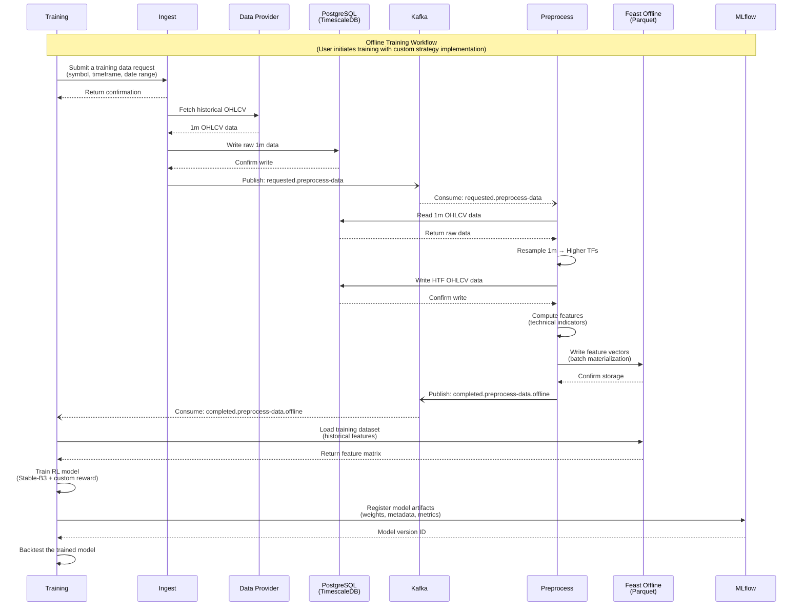
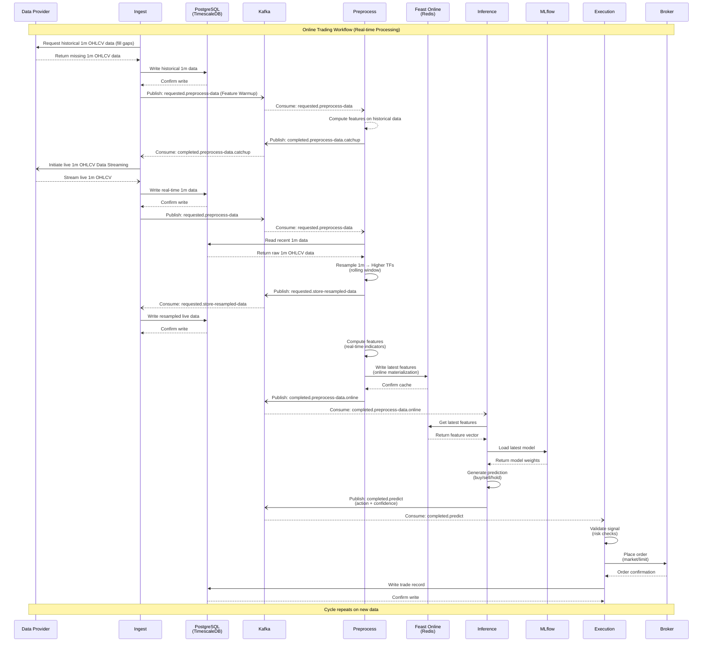

# System Architecture

This document provides detailed architectural views of the DRL Trading Framework, including workflow diagrams, service communication patterns, and key design decisions.

## Architecture Principles

The framework follows these core principles:

- **Hexagonal Architecture**: Clean separation between business logic (core), external interfaces (adapters), and application concerns
- **Event-Driven Communication**: Services communicate asynchronously via Kafka topics for loose coupling
- **Separation of Concerns**: Strategy logic is decoupled from framework infrastructure
- **Testability**: Dependency injection and ports/adapters enable comprehensive testing
- **Scalability**: Microservices can scale independently based on load

## System Workflows

The DRL Trading Framework operates through two distinct workflows:

## Offline Training Workflow

Batch processing for model training using historical data:



## Online Trading Workflow

Real-time processing for live trading:



**Key Characteristics:**
- **Streaming data ingestion**: Continuous flow of market data from external providers
- **Online feature serving**: Low-latency feature access via Redis for real-time predictions
- **Event-driven coordination**: Kafka topics coordinate the prediction and execution pipeline
- **Risk management**: Execution service validates signals before placing orders

## Key Design Decisions

### Why Hexagonal Architecture?

**Benefits:**
- **Testability**: Business logic can be tested without external dependencies
- **Flexibility**: Swap implementations (e.g., Kafka → Redis, Binance → Interactive Brokers) without changing core logic
- **Maintainability**: Clear boundaries between layers reduce coupling

**Structure per service:**
```
src/drl_trading_{service}/
├── adapter/           # External interfaces (Kafka, REST, databases)
├── core/
│   ├── port/         # Business contracts (interfaces)
│   └── service/      # Business logic (implementation)
└── application/
    ├── config/       # Configuration classes
    └── di/           # Dependency injection setup
```

### Why Event-Driven with Kafka?

**Benefits:**
- **Loose coupling**: Services don't need to know about each other
- **Scalability**: Add consumers without modifying producers
- **Resilience**: Message persistence ensures no data loss on failures
- **Async processing**: Long-running tasks (training, backtesting) don't block other services

**Topic naming convention:**
- `requested.*` - Service requests (e.g., `requested.preprocess-data`)
- `completed.*` - Task completions (e.g., `completed.preprocess-data.offline`)
- `error.*` - Error events for monitoring
- `dlq.*` - Dead letter queue for failed messages

### Why Separate Feast Offline and Online Stores?

**Offline (Parquet):**
- Optimized for batch access during training
- Columnar storage for efficient feature retrieval
- Supports time-travel (historical point-in-time correctness)

**Online (Redis):**
- Low-latency key-value access for real-time inference
- In-memory for sub-millisecond lookups
- Only stores latest feature values

This separation follows ML best practices: **train on historical data, serve with real-time data**.

### Why Strategy Decoupling?

The strategy module (`drl-trading-strategy`) is intentionally separated:

**Benefits:**
- **IP protection**: Keep proprietary trading logic private
- **Modularity**: Swap strategies without framework changes
- **Testing**: Framework can be tested with example strategy

**Integration point**: Strategy provides:
- Custom reward functions for RL training
- Trading signal validation rules
- Risk management parameters

## Infrastructure Components

| Component | Purpose | Technology |
|-----------|---------|------------|
| **Data Ingestion** | Market data streaming | drl-trading-ingest |
| **Feature Engineering** | Resampling & indicator computation | drl-trading-preprocess |
| **Model Training** | RL model optimization | drl-trading-training + Stable-B3 |
| **Inference** | Real-time predictions | drl-trading-inference |
| **Execution** | Order placement & management | drl-trading-execution |
| **Message Bus** | Event coordination | Kafka |
| **Feature Store** | ML feature management | Feast (Parquet + Redis) |
| **Model Registry** | Model versioning | MLflow |
| **Time-Series DB** | OHLCV data storage | PostgreSQL + TimescaleDB |

---

**→ Next Steps:**
- **Implement a service**: [Developer Guide](DEVELOPER_GUIDE.md)
- **Deploy infrastructure**: [Infrastructure Guide](INFRASTRUCTURE_GUIDE.md)
- **Create a strategy**: [Strategy Development](STRATEGY_DEVELOPMENT.md)
